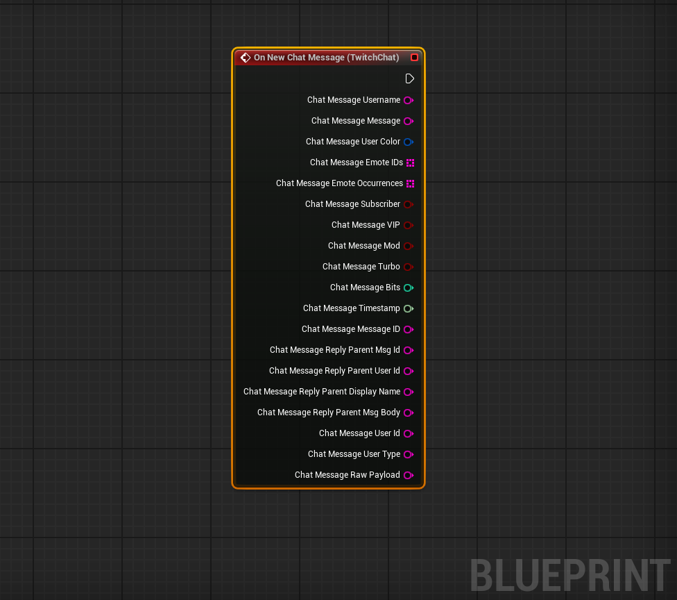
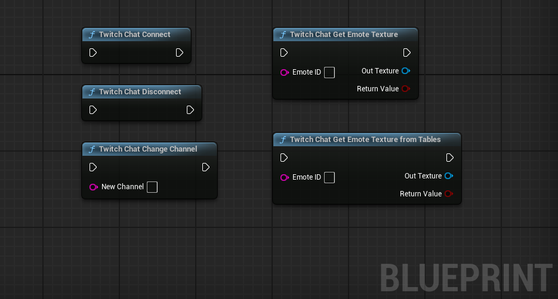

# Twitch Chat for Unreal Engine 5 Editor

This plugin is made to receive Twitch Chat including Emotes into the Unreal Engine Editor and intended to be used for GFX/XR/Broadcast. Not intended to be used for packaged projects. If you want to do that there are other options like the official [Twitch Plugin](https://dev.twitch.tv/docs/game-engine-plugins/) that can be found on their developer portal. 

**IMPORTANT:** Use the issues section of this GitHub Repository for support, questions and feature requests so that everyone can help each other. :) 

## Features

- Connect to Twitch with ClientID and Client Secret. Auto generated Access Token and Refresh Token.
- Auto download static versions of the emotes during capture of chat.
- Add GIF's for emotes manually (Python script for downloading Global Emotes and Channel Emotes are included).
- Get chat in Editor Window
- Get Twitch Chat Data in Blueprints

## TODO
- Get auto-download for animated gifs to work on runtime
- Widget Component to display a line of chat
- Text3D Component to display a line of chat

----

## Installation and Setup

- Make sure to get the latest release from GitHub and put the TwitchChatUE5 folder in the plugins folder of your project.
- Create an app in the [Twitch Developer Console](https://dev.twitch.tv/console/apps) and set the OAuth Redirect URL to https://localhost
- Copy the Client ID and Client Secret into the settings of the plugin. 
- Click Generate Token and follow the instructions on your screen (it will open a browser). This will autofill the Access Token and Refresh Token
- Fill in your own username and the channel you want to receive messages from.

## Usage

You can only connect to one channel at a time. Even when the editor window of Twitch Chat is closed it will get new messages and download new emotes (if set in settings) when still connected. 

- Tools -> Twich Chat will open a window to connect, disconnect within the editor. This is mostly to monitor what is happening and if your chat is connected.
- In what Blueprint you want to use different aspects of the Twich Chat Message add the Twitch Chat Component. In the Details Panel -> Events you will see the On New Chat Message. This will add an event where you have access to the chat message data. 

- Blueprint nodes are available to remotely change the channel, connect, disconnect. Two nodes are included to grab the emotes and use them in the world as a texture. NOTE: After Twitch Chat Change Channel you will have to call the Twitch Chat Connect again.

## Emotes

In the Scripts folder you will find two Python Scripts to download emotes (one for channel specific and one for global emotes). Follow the instructions in the script how to execute and use it. You will only need to do this if you want the GIFs. The static version will be downloaded if you have this setting toggled on. 

You can change the table you want to use in the settings. Auto downloaded emotes are saved in the **Saved/FetchedEmotes** folder of the project.

----

## Contribution
This plugin is under MIT license, but if you extent it in any way it would be really appreciated to submit these for possible incorporation. In this way the community using Twitch and Unreal can grow and help each other :) 

---

## Acknowledgement

- [neil3d](https://github.com/neil3d/UAnimatedTexture5) as the UAnimatedTexture5 (including all of its existing functions) are included in the Twitch Chat Plugin. 
- This plugin was not made with vibe coding, but ChatGPT was consulted.